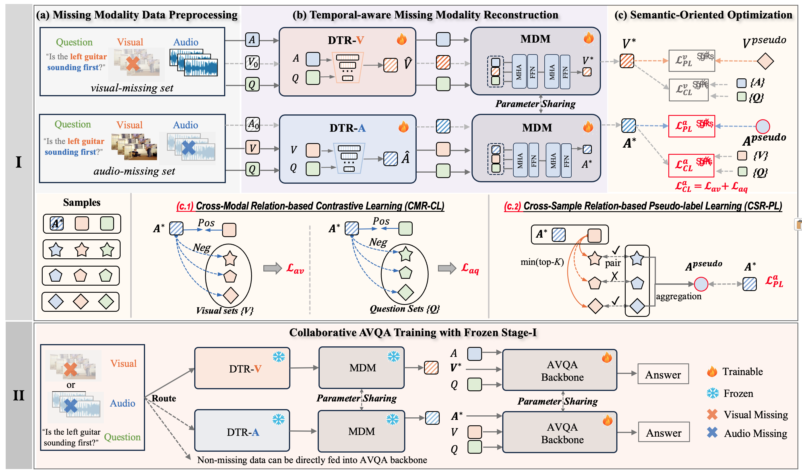

# TM-AVQA

This repository contains the released two-stage code and checkpoints for **Robust Audio-Visual Question Answering with Missing Modality in Training and Testing**.


## Abstract

Audio-Visual Question Answering (AVQA) requires joint reasoning over temporally evolving audio, visual, and textual signals. Existing AVQA methods usually assume that both audio and visual streams are available during training and testing, but real-world systems often face missing modalities caused by device failure, network transmission loss, storage errors, privacy constraints, or user preferences.

This work formulates **Training-time Modality-Missing AVQA (TM-AVQA)**, where modality-complete, audio-missing, and visual-missing samples can all appear during both training and testing. To address this setting, we use a two-stage reconstruction-then-prediction framework. In **Stage-I**, a reconstruction network learns task-oriented feature-level representations for the missing modality from the available modality and question text. The Stage-I model contains Dense Temporal-scale Reconstruction (DTR), Multimodal Dependency Modeling (MDM), Cross-Modal Relation-based Contrastive Learning (CMR-CL), and Cross-Sample Relation-based Pseudo-label Learning (CSR-PL). In **Stage-II**, the trained reconstruction model is integrated into an AVQA backbone, such as AVST, to perform answer prediction with reconstructed and available modalities.

Experiments in the paper construct controlled TM-AVQA variants of MUSIC-AVQA, MUSIC-AVQA-R, and AVQA by deleting one modality from selected samples. Results across multiple missing rates, missing-modality conditions, and AVQA backbones show consistent robustness improvements over modality-complete AVQA baselines and test-time missing-modality methods.

## Method Overview

The TM-AVQA setting contains three sample types:

- **MC, Modality-Complete**: both audio and visual modalities are available.
- **AM, Audio-Missing**: audio is unavailable and should be reconstructed from visual features and question text.
- **VM, Visual-Missing**: visual features are unavailable and should be reconstructed from audio features and question text.

The method follows a two-stage pipeline.


### Stage-I: Missing Modality Reconstruction

Stage-I trains `AVQA_Reconstruct` to infer feature-level missing-modality representations. It does not reconstruct raw waveforms or raw video frames; it reconstructs downstream AVQA-oriented audio/visual features.

Main components:

- **Missing Modality Data Preprocessing**: groups samples into audio-missing and visual-missing branches based on the modality-missing flag file.
- **Dense Temporal-scale Reconstruction (DTR)**: aggregates temporal clues at multiple granularities to recover the missing modality.
- **Multimodal Dependency Modeling (MDM)**: models dependencies among audio, visual, and question features in a shared representation space.
- **CMR-CL**: aligns reconstructed features with semantically related modalities through cross-modal contrastive learning.
- **CSR-PL**: builds pseudo targets from top-k relevant modality-complete samples for feature-level reconstruction supervision.

### Stage-II: AVQA Prediction

Stage-II integrates the trained Stage-I reconstruction module with an AVQA backbone. For samples with missing audio or visual input, the reconstruction module generates the missing feature representation before answer prediction. For modality-complete samples, the original available features can be directly used by the backbone.

The provided Stage-II code is organized around an AVST-style backbone and a Stage-I reconstruction module.

Release note: in the compact code package in this directory, `Stage-II/net_avst.py` is an AVST integration template. It shows where the Stage-I reconstruction module is inserted, but the full AVQA backbone forward path and final `out_qa` prediction head must be present in your final Stage-II implementation.

## Repository Structure

```text
.
|-- readme.md                         # This file
|-- model_stage01_model.pt            # Provided Stage-I reconstruction checkpoint
|-- model_stage02_avqa.pt            # Provided AVST / Stage-II checkpoint
|-- Stage-I/
|   |-- main_reco.py                  # Stage-I training entry
|   |-- dataloader_reco.py            # Stage-I dataloader
|   |-- network/
|   |   |-- network_reco.py           # AVQA_Reconstruct implementation
|   |   |-- han_layer.py              # Attention blocks
|   |   |-- contrastive_enhance.py    # Contrastive loss
|   |   `-- memory_unity.py           # Memory / dependency module
|   `-- data/
|       |-- missing_choice.py         # Generate random missing-modality configs
|       |-- missing_certain.py        # Generate 100% audio/visual missing configs
|       |-- missing_0.1/
|       |   |-- train_0.1.json
|       |   `-- test_0.1.json
|       |-- missing_0.3/
|       |   |-- train_0.3.json
|       |   `-- test_0.3.json
|       |-- missing_0.5/
|       |   |-- train_0.5.json
|       |   `-- test_0.5.json
|       `-- missing_0.7/
|           |-- train_0.7.json
|           `-- test_0.7.json
`-- Stage-II/
    |-- main_avst.py                  # Stage-II AVQA training / testing entry
    |-- dataloader_avst.py            # Stage-II dataloader
    |-- net_avst.py                   # AVST-style reconstruction integration template
    `-- data/
        |-- avqa-train.json           # AVQA training annotations
        `-- avqa-test.json            # AVQA testing annotations
```

## Data And Features

### Dataset Links

Please update the following links before public release.

| Resource | Link / Path | Notes |
| --- | --- | --- |
| TM-AVQA missing configs | `[Hugging Face Datasets](https://huggingface.co/datasets/lzblanlan/trainingMissingData)(modality_missing_data.zip)`| Released |
| Stress test dataset split | `[Hugging Face Datasets](https://huggingface.co/datasets/lzblanlan/trainingMissingData)(stress*.zip)` | Released |


Note that the key name is `anser` in the released AVQA annotation files, and the dataloaders use this spelling.

### Expected Feature Layout

The code expects pre-extracted `.npy` features, indexed by `video_id`.

```text
${AUDIO_DIR}/
|-- 00000024.npy
|-- 00000031.npy
`-- ...

${VIDEO_DIR}/
|-- 00000024.npy
|-- 00000031.npy
`-- ...
```

Feature assumptions used by the current dataloaders:

- Audio features are loaded from `${AUDIO_DIR}/{video_id}.npy` and sampled as `np.load(audio_path)[::6, :]`.
- The resulting audio tensor is expected to have shape close to `[10, 128]`.
- Visual features are loaded from `${VIDEO_DIR}/{video_id}.npy`.
- The visual tensor is expected to have shape close to `[10, 512, 14, 14]` before the dataloader permutes it to `[10, 14, 14, 512]`.
- The paper uses VGGish audio features and ResNet-18 visual features.

## Modality-Missing Config Files

The modality-missing config files define whether audio or visual modality is missing for each question/video pair.

Released config paths:

```text
Stage-I/data/missing_0.1/train_0.1.json
Stage-I/data/missing_0.1/test_0.1.json
Stage-I/data/missing_0.3/train_0.3.json
Stage-I/data/missing_0.3/test_0.3.json
Stage-I/data/missing_0.5/train_0.5.json
Stage-I/data/missing_0.5/test_0.5.json
Stage-I/data/missing_0.7/train_0.7.json
Stage-I/data/missing_0.7/test_0.7.json
```

Each item follows this format:

```json
{
  "question_id": 15,
  "video_id": "00000046",
  "is_audio_missing": true,
  "is_visual_missing": false
}
```

Meaning:

- `is_audio_missing = true`: the audio feature is masked as unavailable.
- `is_visual_missing = true`: the visual feature is masked as unavailable.
- Both flags should not be `true` for the same sample in the current setup.
- If both flags are `false`, the sample is modality-complete.

To generate additional random missing-modality splits, edit the paths and missing rate in `Stage-I/data/missing_choice.py`, then run:

```bash
python Stage-I/data/missing_choice.py
```

To generate 100% audio-missing and 100% visual-missing test configs, edit the paths in `Stage-I/data/missing_certain.py`, then run:

```bash
python Stage-I/data/missing_certain.py
```

## Checkpoints

This release contains two model weight files (Please refer to https://huggingface.co/lzblanlan/save_models/tree/main):

| File | Intended usage |
| --- | --- |
| `model_stage01_model.pt` | Stage-I reconstruction checkpoint. Use this as `--path_phase01` when training or testing Stage-II. |
| `model_stage02_avqa.pt` | Stage-II checkpoint. Use this to initialize the AVQA backbone in Stage-II. |

## Environment

The exact package versions can be adjusted to match your CUDA environment. A typical setup is:

```bash
conda create -n tm-avqa python=3.8 -y
conda activate tm-avqa

# Install the PyTorch build matching your CUDA driver.
# Example only; please replace it with the command from https://pytorch.org/.
pip install torch torchvision torchaudio

pip install numpy pandas pillow munch einops thop tqdm
```

The released scripts call `.cuda()` directly, so a CUDA-enabled PyTorch environment is expected.

## Important Path Notes Before Running

The released scripts still contain several original absolute paths and package names. Before running, search and update them for your local environment:

- Replace all `your path/...` defaults with local dataset and feature paths.
- If using the compact directory layout in this release, make sure the Stage-II imports point to the provided files, for example `net_avst.py` and `dataloader_avst.py`, or place them under the original `net_grd_avst/` package layout.
- Make sure the final Stage-II model includes the complete AVST / AVQA backbone and returns the same values expected by `Stage-II/main_avst.py`.
- `Stage-I/network/network_reco.py` imports `utli.transformer_block` and `utli.pos_embedding`; these imports are not used by the current code body. If your environment raises an import error, either provide the original `utli/` package from the full project or remove the unused imports.

## Run Stage-I: Missing-Modality Reconstruction

The following command trains the reconstruction network on the released 30% missing-modality configuration.

```bash
ROOT=$(pwd)
MISSING_RATE=0.3

AUDIO_DIR=/path/to/vggish
VIDEO_DIR=/path/to/res18_14_14
SAVE_DIR=${ROOT}/checkpoints

python Stage-I/main_reco.py \
  --audio_dir "${AUDIO_DIR}" \
  --video_dir "${VIDEO_DIR}" \
  --label_train "${ROOT}/Stage-II/data/avqa-train.json" \
  --label_test "${ROOT}/Stage-II/data/avqa-test.json" \
  --flag_file "${ROOT}/Stage-I/data/missing_${MISSING_RATE}/train_${MISSING_RATE}.json" \
  --reserve_modality_01 audio \
  --reserve_modality_02 visual \
  --mode train \
  --scales 4 \
  --topk 8 \
  --batch_size 32 \
  --epochs 10 \
  --epochs_02 10 \
  --lr 1e-4 \
  --lr_02 1e-4 \
  --model_save_dir "${SAVE_DIR}" \
  --checkpoint_file "stage1_missing_${MISSING_RATE}" \
  --save_model_flag True
```

For other missing rates, set `MISSING_RATE` to `0.1`, `0.5`, or `0.7`.

## Run Stage-II: AVQA Training With Stage-I Reconstruction

Stage-II loads the Stage-I checkpoint and integrates it with an AVQA backbone. The command below uses the provided Stage-I checkpoint and 30% missing-modality split. It assumes your Stage-II integration has already been normalized according to the path notes above.

Before running, ensure the Stage-II script can find:

- Stage-I checkpoint: `model_stage01_model.pt` or your trained Stage-I checkpoint.
- Stage-II checkpoint: `model_stage02_avqa.pt`, after updating the hard-coded AVST path in `Stage-II/main_avst.py`.
- Missing configs for training and testing.
- Optional 100% audio-missing and 100% visual-missing configs if you keep the corresponding test dataloaders enabled.

```bash
ROOT=$(pwd)
MISSING_RATE=0.3

AUDIO_DIR=/path/to/vggish
VIDEO_DIR=/path/to/res18_14_14
SAVE_DIR=${ROOT}/checkpoints

STAGE1_CKPT=${ROOT}/model_stage01_model.pt
AVST_CKPT=${ROOT}/model_stage02_avqa.pt

# In Stage-II/main_avst.py, set the AVST loading path to ${AVST_CKPT}
# or add a command-line argument for it before running this command.
python Stage-II/main_avst.py \
  --audio_dir "${AUDIO_DIR}" \
  --video_res14x14_dir "${VIDEO_DIR}" \
  --label_train "${ROOT}/Stage-II/data/avqa-train.json" \
  --label_test "${ROOT}/Stage-II/data/avqa-test.json" \
  --flag_file_train "${ROOT}/Stage-I/data/missing_${MISSING_RATE}/train_${MISSING_RATE}.json" \
  --flag_file_test "${ROOT}/Stage-I/data/missing_${MISSING_RATE}/test_${MISSING_RATE}.json" \
  --flag_file_test_missing_audio "/path/to/missing_certain_audio.json" \
  --flag_file_test_missing_visual "/path/to/missing_certain_visual.json" \
  --path_phase01 "${STAGE1_CKPT}" \
  --mode train \
  --scales 4 \
  --batch-size 64 \
  --epochs 20 \
  --lr 1e-4 \
  --model_save_dir "${SAVE_DIR}" \
  --checkpoint_file "stage2_avst_missing_${MISSING_RATE}" \
  --save_model_flag True
```

## Testing / Evaluation

The Stage-II code contains a `test()` function that reports overall accuracy and question-type accuracy, including:

- Audio Counting
- Audio Comparative
- Visual Counting
- Visual Location
- Audio-Visual Existential
- Audio-Visual Counting
- Audio-Visual Location
- Audio-Visual Comparative
- Audio-Visual Temporal
- Overall Accuracy

If you use a trained Stage-II checkpoint, load it into the Stage-II model and run the `test()` branch with the desired missing-modality config. In the compact release, the testing branch should be treated as a template: expose a `--stage2_checkpoint` argument, build the test dataloader in test mode, and load the saved Stage-II weights before calling `test()`.

```bash
ROOT=$(pwd)
MISSING_RATE=0.3


python Stage-II/main_avst.py \
  --audio_dir /path/to/vggish \
  --video_res14x14_dir /path/to/res18_14_14 \
  --label_test "${ROOT}/Stage-II/data/avqa-test.json" \
  --flag_file_test "${ROOT}/Stage-I/data/missing_${MISSING_RATE}/test_${MISSING_RATE}.json" \
  --path_phase01 "${ROOT}/model_stage01_model.pt" \
  --mode test
```

## Acknowledgements

This project builds on AVQA research and feature extraction pipelines based on VGGish and ResNet-18. Please also follow the licenses and usage terms of the original AVQA datasets, pretrained feature extractors, and AVQA backbones.
